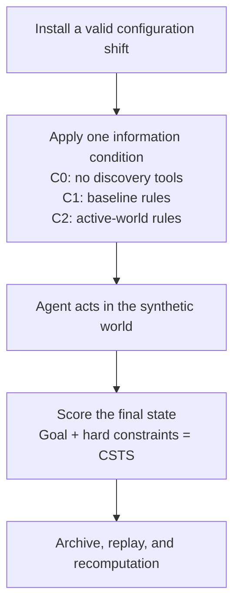

# CascadeShift

**A reproducible synthetic case study of configuration-aware tool use.**

[](pyproject.toml)
[](LICENSE)
[](RESULTS.md)

CascadeShift studies a narrow question: after a valid configuration change, does access to the
current configuration help a tool-using agent complete a task without violating a final-state
constraint? The repository contains a synthetic access-management environment, a historical
450-episode archive, deterministic verification, and a separate six-case measurement-interface
repair. It is research software, not deployment guidance.



Constraint-Safe Task Success (CSTS) requires both the requested goal and every stated hard
constraint to hold at the end of an episode.

## Evidence at a glance

The historical study used 20 hand-authored parent tasks, 30 valid shifted worlds, three
information conditions, and three repeats per cell. Configuration changes were installed before
each episode. An oracle first checked that a constraint-safe plan existed.

| Condition | Information available to the agent |
| --- | --- |
| C0 | No rule-discovery tools |
| C1 | Rules from the frozen baseline configuration |
| C2 | Rules from the configuration active in that world |

The archive used one local model/runtime configuration, recorded as `qwen3.8-27b`, with the
quantized artifact identified in [Provenance](PROVENANCE.md). There is no independent replication.

## Result

The preregistered, parent-bootstrap estimate for C2 versus C1 was **+9.2 percentage points**, with
a 95% interval from **-1.7 to +20.8 percentage points**. The interval includes zero. The study did
not establish a benefit from current rule access, and it did not rule one out within this synthetic
setup.

| Measure | Result |
| --- | ---: |
| Shifted worlds, C1 | 53/90 CSTS passes |
| Shifted worlds, C2 | 51/90 CSTS passes |
| Unchanged worlds, C1 | 47/60 CSTS passes |
| Unchanged worlds, C2 | 41/60 CSTS passes |
| Primary adjusted estimate | +9.2 pp, 95% interval -1.7 to +20.8 pp |

For each parent, the analysis subtracts its baseline C2-minus-C1 difference from its shifted
C2-minus-C1 difference, then averages those 20 values. Pooled counts do not reconstruct the
primary estimate because parents have unequal numbers of shifted cases. [Results](RESULTS.md)
defines the estimand and its limits.

The discovery interface returned rules only. A direct response audit found no frozen/current
discovery difference in 14 of 30 shifted worlds, including 9 of 15 plan-invalidating worlds. This
does not identify which facts an agent needed in a particular case. It does show that the treatment
exposed no difference for a substantial part of the shifted set. The archive result is valid for
the implemented interface but provides weak evidence about configuration freshness more broadly.

H2 includes goal misses and is best read as "finished but failed." H5 measures partial overlap with
one oracle-plan closure. The [technical note](TECHNICAL-NOTE.md) explains both diagnostics.

## Worked case without a model

Measurement-v2 case M2-001 uses a visible policy threshold of 80 in the baseline world and 40 in
the active world. Granting Project Console directly passes in the baseline world. Under the active
threshold, the same grant revokes Core Workspace and fails CSTS. Revoking Temporary Workspace
first, then granting Project Console, passes in the active world. The
[example command](REPRODUCIBILITY.md#check-the-v2-construction-example) prints each check.

## Run the checks

Install [uv](https://docs.astral.sh/uv/), then run:

```sh
git clone https://github.com/jlov7/CascadeShift-Research.git
cd CascadeShift-Research
uv sync --locked --all-groups
uv run python examples/configuration_visibility.py
make verify
```

The example prints M2-001. `make verify` runs linting, type checks, tests, package checks, archive
replay, visibility analysis, and the six measurement-v2 construction cases. It does not run a
model.

To inspect the historical archive directly:

```sh
uv run python scripts/replay_study.py
uv run python scripts/audit_visibility.py
uv run python scripts/recompute_results.py
```

These scripts replay 587 archived actions and 450 final verdicts against the frozen engine,
compare C1 and C2 discovery responses, and recompute the 450-cell result. They check consistency
between the archive and engine. They do not provide fresh inference, independent replication, or
an independent simulator. [Reproducibility](REPRODUCIBILITY.md) documents the exact scope.

## Measurement-v2 boundary

Version `1.3.0` includes a separate, offline interface with six hand-built construction cases. Each
case checks that an observable configuration fact changes whether a short plan is safe, and that
restoring the fact restores the baseline plan. The interface evaluates goal completion, hard
constraints, an explicit success assertion, and a final `finish_task` call separately.

The six construction checks pass. A bounded provider diagnostic stopped after seven records and 15
requests because the selected provider and the finish-only caller contract were incompatible. Six
terminal records contained no executed business action; the seventh was invalid under the stop
rule. The repository contains a sanitized, source-derived summary, not independently reproducible
model-run data. It supports no condition comparison, null result, or efficacy claim. See
[Results](RESULTS.md) and [Future study](docs/future-study.md).

## Repository guide

| Path | Purpose |
| --- | --- |
| [`RESULTS.md`](RESULTS.md) | Estimands, results, and interpretation limits |
| [`REPRODUCIBILITY.md`](REPRODUCIBILITY.md) | Commands and the scope of each check |
| [`TECHNICAL-NOTE.md`](TECHNICAL-NOTE.md) | Historical design and measurement caveats |
| [`PROVENANCE.md`](PROVENANCE.md) | Source, model-artifact, and AI-assistance disclosures |
| [`docs/future-study.md`](docs/future-study.md) | Requirements for a future empirical study |
| [`artifacts/results/confirmatory/`](artifacts/results/confirmatory/) | Historical 450-episode archive and summaries |

Contributions are welcome within the documented research boundary; see
[Contributing](CONTRIBUTING.md). CascadeShift is licensed under the
[Apache License 2.0](LICENSE). Do not provide production credentials, personal data, customer
records, or sensitive configuration data to the prototype.

---

<sub>This is a personal research and development project. It is not affiliated with, endorsed by, or sponsored by my employer. Any views expressed are my own.</sub>
